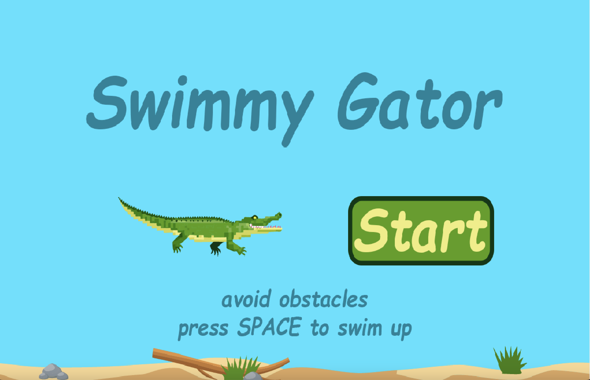

# Swimmy Gator

This repository contains the source code and documentation for the Swimmy Gator game project, developed using the Gator Engine. 
<h2> Table of Contents </h2>

- [Overview](#overview)
- [Getting Started](#getting-started)
- [Features](#features)

---

## Overview

The project follows a structure inspired by Unity game development principles, but is implemented in Java using the **Gator Engine**. The game’s architecture supports multiple views (start menu, gameplay, end game), and key gameplay mechanics such as gravity, impulse physics, dynamic obstacle behavior, power-up objects, and background scrolling are handled within the engine.



---

## Getting Started

### Installation

1. Clone the repository:

   ```bash
   git clone https://github.com/your-username/Game-Search-Engine.git
   cd Gator-Engine
   
3. Open repository in Java compatible environment (IntelliJ, VS Code)

4. Install Java Development Kit (JDK):
Make sure you have the JDK installed. You can check if it’s installed by running:
```bash
java -version
javac -version
```
If not installed, you can download and install the JDK from the official Oracle website or use a package manager like apt (Linux) or brew (macOS).

### Usage
Run src/GatorEngine.java in your IDE or terminal using the following command:

```bash
java src/GatorEngine.java
```

## Features

### Game Controls
Players control the gator’s movement using gravity and impulse forces. Pressing the space bar makes the gator jump, while the game ends if the gator hits the ground or an obstacle.

### Obstacle Behavior
Obstacles spawn at regular intervals and move from right to left, increasing in speed over time. Colliding with an obstacle ends the game.

### Scrolling Background
The background scrolls seamlessly from right to left, matching the speed of obstacles, and resets when the game ends.

### Game Reset
Once the game ends, the gator stops moving, and the game resets with each new session.

### Power-up: Invincibility
A temporary power-up that makes the gator invincible to obstacles. Colliding with obstacles bounces them off the screen, allowing the player to continue without losing the game.

